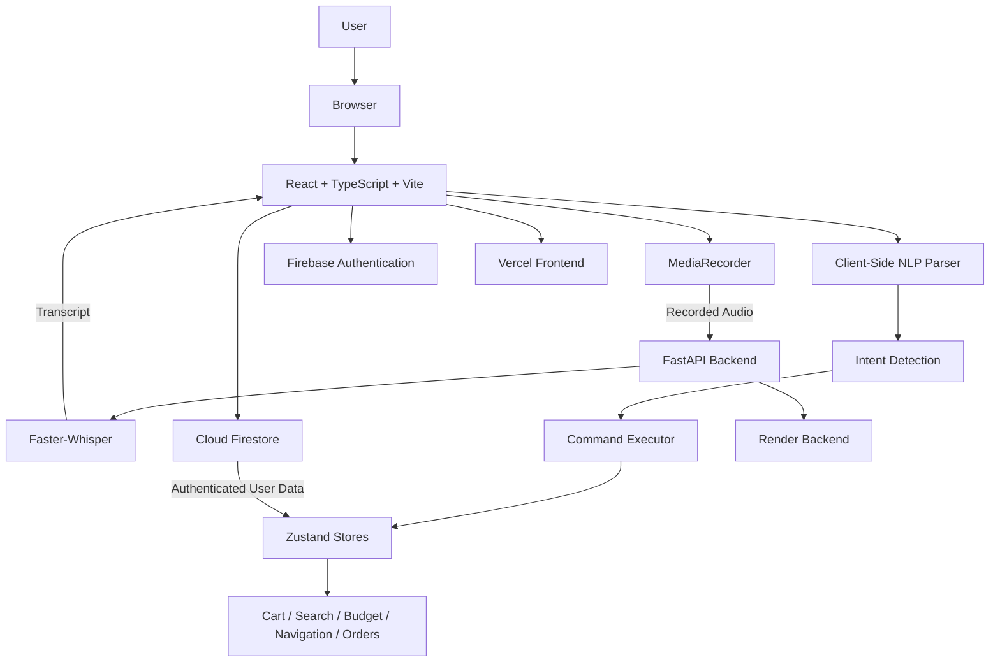
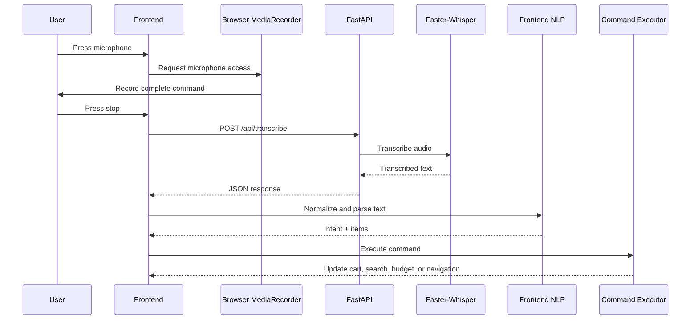

# VoiceCart AI

## Voice-First Multilingual Grocery Shopping Application

# Requirement Coverage

The following table maps the requirements of the Voice Command Shopping Assistant project to their implementation in VoiceCart AI.

| Project Requirement | VoiceCart AI Implementation |
|---|---|
| Voice Command Recognition | Users can record complete grocery instructions using the microphone and process them as a single voice command. |
| Natural Language Processing | The application processes transcribed text to identify intents, products, quantities, units, search requests, cart actions, budget commands, and navigation commands. |
| Multilingual Support | VoiceCart AI supports English, Hindi, and Hinglish through Faster-Whisper transcription and client-side normalization rules. |
| Add Items | Products can be added individually or as part of multi-item voice commands. |
| Remove and Modify Items | Users can remove products, update quantities, and clear the cart through supported commands and application controls. |
| Quantity Management | Numeric quantities, Hindi/Hinglish number words, and multiple grocery units such as kg, litre, bottle, packet, dozen, and carton are supported. |
| Item Categorization | Products are organized into grocery categories and subcategories for easier discovery and browsing. |
| Voice-Based Search | Users can search for products through supported voice commands after speech is transcribed and processed. |
| Product Recommendations | The application maintains product and purchase-related information to support product recommendations. |
| Product Substitutes | Alternative products can be identified and suggested when suitable substitutes are available. |
| Budget Management | Users can set a shopping budget and compare the cart total against the configured budget. |
| Smart Cart Optimization | The application can evaluate substitute products and replace suitable items with cheaper alternatives, reporting the estimated savings. |
| Visual Feedback | Cart updates, notifications, recognized actions, and application state changes provide feedback to the user. |
| Error Handling | Voice processing includes error handling and a browser speech-recognition fallback when backend transcription is unavailable. |
| Loading and Processing States | The application displays processing states while voice commands are being recorded and processed. |
| Hosting and Deployment | The React frontend is deployed on Vercel, while the FastAPI and Faster-Whisper transcription backend is deployed on Render. |


## Live Application

**Production Deployment: https://voice-cart-ai-iota.vercel.app**

Open the deployed application: https://voice-cart-ai-iota.vercel.app

---

## Table of Contents

- [Project Overview](#project-overview)
- [Live Deployment](#live-deployment)
- [Problem Statement](#problem-statement)
- [Key Features](#key-features)
- [Application Pages](#application-pages)
- [Voice Command Examples](#voice-command-examples)
- [Technology Stack](#technology-stack)
- [System Architecture](#system-architecture)
- [How the Application Works](#how-the-application-works)
- [Voice Processing Pipeline](#voice-processing-pipeline)
- [Frontend Architecture](#frontend-architecture)
- [Backend API](#backend-api)
- [Data Persistence and Authentication](#data-persistence-and-authentication)
- [Project Structure](#project-structure)
- [Dependencies](#dependencies)
- [Environment Configuration](#environment-configuration)
- [Run Locally](#run-locally)
- [Deployment](#deployment)
- [Performance and Latency](#performance-and-latency)
- [Constraints and Known Limitations](#constraints-and-known-limitations)
- [Screenshot Gallery](#screenshot-gallery)
- [API Testing](#api-testing)
- [Repository Information](#repository-information)

---

# Project Overview

VoiceCart AI is a full-stack, voice-enabled grocery shopping application that allows users to interact with a grocery catalogue and shopping cart using natural spoken commands.

The application is designed to accept grocery commands in:

- English
- Hindi
- Hinglish
- Mixed English-Hindi grocery commands

Instead of requiring the user to manually search for every product, the application records the user's complete voice command, sends the recorded audio to a Python backend, transcribes it using a local Faster-Whisper model, and then processes the resulting text through a client-side command parser.

The parsed command is executed directly inside the application. Depending on the command, VoiceCart AI can:

- Add one or multiple products to the cart
- Understand quantities and units
- Understand several Hindi and Hinglish grocery words
- Search for products
- Remove products
- Update quantities
- Clear the shopping cart
- Set a shopping budget
- Optimize the cart
- Navigate to the cart or checkout
- Add recipe ingredients to the cart
- Display alternative products
- Maintain user profiles, addresses, orders, and purchase history

The project consists of two independently deployed applications:

| Layer | Technology | Deployment |
|---|---|---|
| Frontend | React, TypeScript, Vite | Vercel |
| Backend | FastAPI, Faster-Whisper | Render |
| Authentication and cloud persistence | Firebase Authentication and Cloud Firestore | Firebase |

---

# Live Deployment

## Production Application

**https://voice-cart-ai-iota.vercel.app**

## Backend API

**https://voicecart-ai-qrgf.onrender.com**

The backend exposes the transcription service used by the deployed frontend.

A deployed frontend requires the following environment variable:

```env
VITE_API_URL=https://voicecart-ai-qrgf.onrender.com
```

The application uses this value to send recorded audio to:

```text
POST /api/transcribe
```

---

# Problem Statement

Traditional grocery applications primarily depend on manual searching, typing, filtering, and repeated product selection.

VoiceCart AI explores a voice-first interaction model in which a user can speak a complete grocery instruction naturally.

For example:

> Do kilo seb aur ek kilo kela cart mein add kar do.

The intended workflow is:

```text
User speaks
      ↓
Browser records audio
      ↓
Audio is uploaded to the FastAPI backend
      ↓
Faster-Whisper transcribes the speech
      ↓
Transcribed text is returned to the frontend
      ↓
Client-side NLP normalizes English/Hindi/Hinglish words
      ↓
Intent and grocery items are extracted
      ↓
The corresponding cart, search, budget, recipe, or navigation action is executed
```
The FastAPI backend is responsible only for receiving the recorded audio and performing speech-to-text transcription using Faster-Whisper. After the transcription result is returned, command interpretation, language normalization, intent detection, product matching, quantity extraction, and the corresponding shopping actions are handled by the React frontend.
---

# Key Features

## 1. Complete Voice Order Recording

The user can speak an entire grocery order in one microphone session.

The application does not require one voice request per product.

Example:

> Add two milk, one bread and three bananas to my cart.

The frontend records the complete audio session using the browser's `MediaRecorder` API. When the user stops recording, the audio is sent to the transcription backend.

---

## 2. English, Hindi and Hinglish Support

VoiceCart AI supports three language modes:

- Auto / Hinglish
- English
- Hindi

The backend uses Faster-Whisper for speech-to-text processing.

The frontend additionally contains normalization rules for common grocery-related words and speech-recognition variations.

Examples include:

| Spoken word | Normalized product |
|---|---|
| doodh / dudh | milk |
| seb / seeb | apple |
| kela / kele | banana |
| pyaz / pyaaz / pyaaj | onion |
| tamatar | tomato |
| chawal | rice |
| anda / ande | egg |
| pani / paani | water |
| dahi | yogurt |
| makhan | butter |
| tel | oil |
| atta / aata | flour |

The parser also recognizes Hindi and Hinglish number words such as:

```text
ek
do
teen
chaar
paanch
che
saat
aath
nau
das
```

as well as their Devanagari equivalents.

---

## 3. Multi-Item Voice Commands

The frontend command parser can split an order containing multiple items.

For example:

> Add 2 milk and 1 bread and 3 bananas.

The parser identifies multiple order segments and produces a `MULTI_ADD` intent.

Each item is then matched against the available product catalogue and added to the cart independently.

---

## 4. Quantity and Unit Recognition

The application recognizes numeric quantities and several grocery units.

Supported units include:

- bottle
- packet
- piece
- kg
- kilo
- litre
- liter
- bag
- carton
- dozen
- cup
- tube
- box
- bar
- bunch

Examples:

```text
2 kilo apples
1 litre milk
3 packets biscuits
2 bottles water
```

---

## 5. Voice-Based Cart Operations

The command system supports multiple intents.

### Add a product

```text
Add 1 litre milk
```

### Add multiple products

```text
Add two milk and one bread
```

### Hinglish order

```text
Mujhe do milk aur ek bread chahiye
```

### Search for a product

```text
Find apples
```

### Remove a product

```text
Remove milk from my cart
```

### Clear the cart

```text
Clear my cart
```

### Set a budget

```text
Set my budget to 500
```

### Optimize the cart

```text
Optimize my cart
```

### Go to checkout

```text
Proceed to checkout
```

---

## 6. Browser Speech Recognition Fallback

The primary voice flow uses:

```text
MediaRecorder
        +
FastAPI transcription backend
        +
Faster-Whisper
```

If backend transcription fails and the browser supports the Web Speech API, the application attempts to fall back to browser speech recognition.

The fallback uses:

```text
window.SpeechRecognition
```

or:

```text
window.webkitSpeechRecognition
```

depending on browser support.

This fallback is not guaranteed to be available in every browser.

---

## 7. Microphone Audio Handling

The browser requests microphone access with the following audio processing preferences:

```text
echoCancellation: true
noiseSuppression: true
```

The recorder attempts to use a supported MIME type from:

```text
audio/webm;codecs=opus
audio/webm
audio/mp4
audio/ogg;codecs=opus
```

The recording bitrate is configured as:

```text
32000 bits per second
```

Audio is collected in chunks and combined into a `Blob` after recording stops.

The backend currently accepts recordings up to:

```text
25 MB
```

---

## 8. Product Discovery

The application includes a product discovery experience that allows users to browse the grocery catalogue and open product details.

The product store maintains:

- Product data
- Search state
- Search history
- Purchase history
- Product recommendations
- Substitute product information

---

## 9. Shopping Cart

The cart supports:

- Adding products
- Removing products
- Updating quantities
- Clearing the cart
- Calculating totals
- Budget tracking
- Cart optimization
- Order creation

The application also provides feedback through toast notifications and browser text-to-speech responses.

---

## 10. Budget Support

A user can set a shopping budget through a voice command or application interaction.

Example:

```text
Set my budget to 500
```

When products are added, the application can compare the estimated cart total with the configured budget and notify the user when the budget is exceeded.

---

## 11. Cart Optimization

The application includes a cart optimization flow.

The optimizer evaluates available substitute products and can replace items with cheaper alternatives when appropriate.

The result reports the estimated amount saved.

---

## 12. Recipe-Based Shopping

The command system supports recipe-oriented actions.

Example intent:

```text
COOK_RECIPE
```

The application resolves ingredients for supported dishes and adds the required products to the cart.

---

## 13. Product Substitutes

The command executor can request alternatives for a product.

The substitute flow uses the product store to find same-type alternatives and presents them through the application notification system.

---

## 14. User Authentication

The application supports:

- Guest access
- Email and password authentication
- Google sign-in

Firebase Authentication is used for authenticated users.

Firebase scripts are dynamically loaded at runtime.

Local authentication persistence is configured using:

```text
firebase.auth.Auth.Persistence.LOCAL
```

This allows authenticated sessions to persist in the browser.

---

## 15. User Profiles

The profile system allows users to manage:

- Full name
- Email address
- Phone number
- Gender
- Date of birth

The profile page also displays profile completion information.

---

## 16. Multiple Delivery Addresses

Users can manage multiple delivery addresses.

Each address can include:

- Name
- Phone number
- Address line 1
- Address line 2
- Landmark
- City
- State
- Pincode
- Address label
- Default address selection

Addresses can be added, edited, deleted, and marked as the default address.

---

## 17. Checkout and Demo UPI Flow

The checkout page includes:

- Delivery address selection
- Order summary
- Subtotal calculation
- Delivery calculation
- Total calculation
- QR code generation
- Payment status selection

The QR code is generated using:

```text
qrcode.react
```

The current QR payment flow is explicitly a demonstration flow.

The application can mark an order as:

```text
Confirmed
```

or:

```text
Pending
```

The QR code does not process a real financial transaction.

---

## 18. Order Management

The application includes:

- Order listing
- Order status filtering
- Individual order details
- Payment summary
- Delivery address information

Available order status filters include:

- All
- Pending
- Confirmed
- Delivered
- Cancelled

---

## 19. Purchase History and Insights

The history page provides information such as:

- Number of orders
- Total spending
- Frequently bought products
- Number of tracked items
- Recent orders
- Product purchase counts

---

## 20. Firebase Cloud Synchronization

For authenticated non-guest users, VoiceCart AI synchronizes selected application data with Cloud Firestore.

The user document can store:

```text
profile
orders
history
searches
updatedAt
```

When an authenticated user returns to the application, the application loads the stored data and hydrates the relevant Zustand stores.

Guest users do not use this cloud-loading flow.

---

# Application Pages

The current application routes are listed below.

| Route | Page | Purpose |
|---|---|---|
| `/` | Redirect | Redirects to `/login` |
| `/login` | Landing | Sign in, registration, guest access |
| `/home` | Home | Main grocery and voice interaction screen |
| `/products` | Discover | Product discovery and search |
| `/products/:id` | Product Details | Individual product information |
| `/cart` | Shopping List | Cart management |
| `/checkout` | Checkout | Address selection and demo payment flow |
| `/orders` | Orders | Order management and status filtering |
| `/orders/:id` | Order Details | Individual order information |
| `/history` | History | Purchase history and insights |
| `/profile` | Profile | Personal details, addresses, and settings |

All application pages except the landing route are protected by the authentication flow.

---

# Voice Command Examples

## Single Product

```text
Add 1 litre milk
```

## Multiple Products

```text
Add two milk and one bread
```

## Hinglish

```text
Mujhe do milk aur ek bread chahiye
```

## Hindi/Hinglish Grocery Order

```text
Do kilo seb aur ek kilo kela cart mein add kar do
```

## Search

```text
Find apples
```

## Remove

```text
Remove milk
```

## Clear Cart

```text
Clear my cart
```

## Budget

```text
Set my budget to 500
```

## Optimize

```text
Optimize my cart
```

## Checkout

```text
Proceed to checkout
```

---

# Technology Stack

## Frontend

| Technology | Purpose |
|---|---|
| React 18 | User interface |
| TypeScript | Type safety |
| Vite | Development server and production build |
| React Router DOM | Client-side routing |
| Zustand | Application state management |
| Tailwind CSS | Styling utilities |
| PostCSS | CSS processing |
| Autoprefixer | Browser CSS compatibility |
| Lucide React | Icons |
| QRCode React | Checkout QR generation |
| date-fns | Date utilities |
| clsx | Conditional class composition |
| tailwind-merge | Tailwind class merging |

## Backend

| Technology | Purpose |
|---|---|
| Python | Backend runtime |
| FastAPI | REST API framework |
| Uvicorn | ASGI server |
| Faster-Whisper | Speech-to-text transcription |
| python-multipart | Multipart audio upload handling |

## Cloud Services

| Service | Purpose |
|---|---|
| Vercel | Frontend deployment |
| Render | FastAPI backend deployment |
| Firebase Authentication | User authentication |
| Cloud Firestore | Cloud persistence |

---

# System Architecture



---

# How the Application Works

## Step 1: Application Startup

When the application starts, the bootstrap component performs two primary actions:

1. Loads the product data.
2. Initializes the authentication store.

The relevant stores are then responsible for maintaining the application state.

For authenticated non-guest users, the application also attempts to load cloud data from Firestore.

The following data can be hydrated:

```text
Profile
Orders
Purchase history
Search history
```

---

## Step 2: User Authentication

The user can enter the application through:

- Guest access
- Email/password authentication
- Google sign-in

Protected application routes are wrapped by the authentication layer.

The application uses Firebase Authentication for authenticated users.

---

## Step 3: Starting Voice Input

When the microphone is pressed, the application checks whether the browser supports:

```text
navigator.mediaDevices.getUserMedia
```

and:

```text
MediaRecorder
```

If both are available, microphone access is requested.

If the primary recording APIs are unavailable, the application attempts to use browser speech recognition instead.

---

## Step 4: Recording Audio

The browser creates a `MediaRecorder`.

Audio chunks are collected while the microphone is active.

The user can speak the complete grocery order before pressing Stop.

After recording stops:

1. The microphone tracks are stopped.
2. The audio chunks are combined into a `Blob`.
3. The application validates that audio was actually recorded.
4. The interface switches to the processing state.

---

## Step 5: Sending Audio to the Backend

The audio is placed inside `FormData`.

The request contains:

```text
audio
language_mode
```

The request is sent to:

```text
POST /api/transcribe
```

The backend URL is determined by:

```text
VITE_API_URL
```

If no `VITE_API_URL` value is configured, the application uses a relative URL.

---

## Step 6: Faster-Whisper Transcription

The backend:

1. Receives the uploaded audio.
2. Validates the language mode.
3. Validates that the audio is not empty.
4. Rejects audio larger than the configured maximum size.
5. Writes the recording to a temporary file.
6. Loads the cached Whisper transcription model.
7. Transcribes the audio.
8. Returns the transcription text and language metadata.
9. Deletes the temporary audio file.

The transcription model is cached using:

```python
@lru_cache(maxsize=1)
```

This prevents the application from creating a new model object for every request while the backend instance remains alive.

---

## Step 7: Client-Side Command Parsing

The transcription text is processed by:

```text
src/utils/nlp.ts
```

The parser:

1. Converts text to lowercase.
2. Normalizes common Hinglish expressions.
3. Maps Hindi and Hinglish grocery words to catalogue-friendly names.
4. Converts supported number words into numeric values.
5. Removes unnecessary command filler words.
6. Splits multi-item orders.
7. Determines the command intent.
8. Extracts product names, quantities, and units when applicable.

The primary voice command parsing and execution flow currently happens on the frontend after transcription.

The backend also contains a `/api/parse` endpoint, but the main frontend voice flow currently uses the local TypeScript parser in `src/utils/nlp.ts`.

---

## Step 8: Intent Execution

The parsed result is passed to the command executor.

The executor can perform actions including:

```text
MULTI_ADD
ADD_ITEM
REMOVE_ITEM
UPDATE_QUANTITY
SEARCH_PRODUCT
FILTER_PRODUCTS
GET_SUBSTITUTES
SHOW_LIST
CLEAR_LIST
SET_BUDGET
OPTIMIZE_CART
COOK_RECIPE
PROCEED_CHECKOUT
CONFIRM_PAYMENT
```

The command executor then updates the appropriate Zustand store or navigates the user to the required page.

---

# Voice Processing Pipeline



---

# Frontend Architecture

The frontend follows a component, page, hook, utility, and store-based structure.

## Pages

Application screens are located in:

```text
src/pages/
```

Current pages include:

```text
Landing.tsx
Home.tsx
Discover.tsx
ProductDetails.tsx
ShoppingList.tsx
Checkout.tsx
Orders.tsx
OrderDetails.tsx
History.tsx
Profile.tsx
```

## Components

Reusable interface components are located in:

```text
src/components/
```

Examples include:

```text
AudioVisualizer.tsx
BottomNav.tsx
CartItem.tsx
Layout.tsx
ProductCard.tsx
ProfileDropdown.tsx
ProtectedRoute.tsx
QuantityStepper.tsx
ToastStack.tsx
VoiceAssistantDrawer.tsx
VoiceButton.tsx
```

## Hooks

Custom application behavior is implemented through hooks such as:

```text
useAudioAnalyser.ts
useCommandExecutor.ts
useVoiceRecognition.ts
```

## Stores

Global state is managed using Zustand.

The current stores include:

```text
useAddressStore.ts
useAuthStore.ts
useCartStore.ts
useProductStore.ts
useUserStore.ts
```

---

# Backend API

## Base URL

Production backend:

```text
https://voicecart-ai-qrgf.onrender.com
```

---

## GET `/`

Returns backend availability information.

Example response:

```json
{
  "status": "online",
  "message": "VoiceCart multilingual backend is running",
  "model": "small"
}
```

---

## GET `/api/health`

Returns a basic health response.

Example response:

```json
{
  "status": "ok",
  "model": "small"
}
```

---

## POST `/api/transcribe`

Transcribes uploaded audio.

### Request

The request uses:

```text
multipart/form-data
```

Fields:

| Field | Type | Required | Description |
|---|---|---|---|
| `audio` | File | Yes | Recorded audio |
| `language_mode` | String | No | `auto`, `english`, or `hindi` |

### Example response

```json
{
  "text": "do kilo seb aur ek kilo kela cart mein add kar do",
  "language": "hi",
  "language_probability": 0.0,
  "mode": "auto"
}
```

The exact language and probability values depend on the Faster-Whisper transcription result.

### Validation

The endpoint returns:

- `400` for invalid language mode
- `400` for empty audio
- `413` when the recording exceeds the configured size limit
- `503` for model or runtime availability errors
- `500` for unexpected transcription errors

---

## POST `/api/parse`

The backend also exposes a text command parsing endpoint.

Request body:

```json
{
  "text": "add 2 kilo apples"
}
```

The endpoint performs basic backend-side normalization and intent detection.

However, the deployed frontend's primary voice workflow currently performs command parsing through:

```text
src/utils/nlp.ts
```

after receiving the transcription response.

---

# Faster-Whisper Configuration

The current backend defaults are controlled through environment variables.

| Variable | Default |
|---|---|
| `WHISPER_MODEL` | `small` |
| `WHISPER_CPU_THREADS` | Available CPU count minus one, minimum one |
| `WHISPER_BEAM_SIZE` | `1` |
| `WHISPER_BEST_OF` | `1` |
| `WHISPER_COMPUTE_TYPE` | `int8` |
| `MAX_AUDIO_BYTES` | `26214400` bytes |

The transcription model is configured for CPU execution.

The current implementation uses:

```text
device = cpu
compute_type = int8
num_workers = 1
```

The transcription request also uses:

```text
beam_size = 1
best_of = 1
vad_filter = true
condition_on_previous_text = false
task = transcribe
word_timestamps = false
temperature = 0.0
```

Voice activity detection is enabled to reduce unnecessary silence processing.

The backend also supplies an initial prompt containing common Indian grocery words and examples to provide the transcription model with relevant domain context.

---

# Data Persistence and Authentication

## Firebase Authentication

Firebase Authentication is used for authenticated users.

Supported application flows include:

- Google sign-in
- Email/password sign-in
- Email/password registration
- Guest access

## Cloud Firestore

Cloud synchronization stores selected data under a user document.

The current cloud synchronization utilities handle:

```text
Profile
Orders
Purchase history
Search history
```

Cloud synchronization failures are caught and logged so that the application does not terminate because a cloud synchronization request fails.

---

# Project Structure

```text
VoiceCart-AI/
│
├── public/
│   └── assets/
│       ├── home-hero.png
│       └── login-hero.png
│
├── server/
│   ├── main.py
│   └── requirements.txt
│
├── src/
│   │
│   ├── components/
│   │   ├── AudioVisualizer.tsx
│   │   ├── BottomNav.tsx
│   │   ├── CartItem.tsx
│   │   ├── Layout.tsx
│   │   ├── ProductCard.tsx
│   │   ├── ProfileDropdown.tsx
│   │   ├── ProtectedRoute.tsx
│   │   ├── QuantityStepper.tsx
│   │   ├── ToastStack.tsx
│   │   ├── VoiceAssistantDrawer.tsx
│   │   └── VoiceButton.tsx
│   │
│   ├── data/
│   │   ├── mockData.ts
│   │   └── mockRecipes.ts
│   │
│   ├── hooks/
│   │   ├── useAudioAnalyser.ts
│   │   ├── useCommandExecutor.ts
│   │   └── useVoiceRecognition.ts
│   │
│   ├── lib/
│   │   ├── cloudData.ts
│   │   ├── email.ts
│   │   └── firebase.ts
│   │
│   ├── pages/
│   │   ├── Checkout.tsx
│   │   ├── Discover.tsx
│   │   ├── History.tsx
│   │   ├── Home.tsx
│   │   ├── Landing.tsx
│   │   ├── OrderDetails.tsx
│   │   ├── Orders.tsx
│   │   ├── ProductDetails.tsx
│   │   ├── Profile.tsx
│   │   └── ShoppingList.tsx
│   │
│   ├── store/
│   │   ├── useAddressStore.ts
│   │   ├── useAuthStore.ts
│   │   ├── useCartStore.ts
│   │   ├── useProductStore.ts
│   │   └── useUserStore.ts
│   │
│   ├── types/
│   │   └── index.ts
│   │
│   ├── utils/
│   │   ├── nlp.ts
│   │   ├── recipeResolver.ts
│   │   └── speech.ts
│   │
│   ├── App.tsx
│   ├── index.css
│   └── main.tsx
│
├── .gitignore
├── index.html
├── package.json
├── postcss.config.js
├── tailwind.config.js
├── tsconfig.json
└── vite.config.ts
```

The generated `dist/` directory is a production build output and is not required for normal source development.

---

# Dependencies

## Frontend Runtime Dependencies

Install through:

```bash
npm install
```

Current runtime dependencies include:

```text
clsx
date-fns
firebase
lucide-react
qrcode.react
react
react-dom
react-router-dom
tailwind-merge
zustand
```

## Frontend Development Dependencies

```text
@types/node
@types/react
@types/react-dom
@vitejs/plugin-react
autoprefixer
postcss
tailwindcss
typescript
vite
```

## Backend Dependencies

Install through:

```bash
pip install -r server/requirements.txt
```

The backend requires:

```text
fastapi
uvicorn[standard]
python-multipart
faster-whisper
```

---

# Environment Configuration

## Frontend API Configuration

Create a file named:

```text
.env.local
```

in the project root.

For local development:

```env
VITE_API_URL=http://localhost:8000
```

For the deployed production frontend:

```env
VITE_API_URL=https://voicecart-ai-qrgf.onrender.com
```

---

## Backend Optional Configuration

The backend can run using its default configuration.

Optional environment variables include:

```env
WHISPER_MODEL=small
WHISPER_CPU_THREADS=4
WHISPER_BEAM_SIZE=1
WHISPER_BEST_OF=1
WHISPER_COMPUTE_TYPE=int8
MAX_AUDIO_BYTES=26214400
```

If these values are not supplied, the defaults defined in `server/main.py` are used.

---

## Firebase Configuration

The current project contains Firebase application configuration in:

```text
src/lib/firebase.ts
```

The application dynamically loads Firebase compatibility scripts for:

```text
Firebase App
Firebase Authentication
Cloud Firestore
```

To use authentication and cloud persistence in a separate Firebase project, the Firebase configuration in the project must correspond to that Firebase project, and the required authentication providers and Firestore database must be enabled.

The deployed application also requires its deployed domain to be permitted by the relevant Firebase Authentication configuration.

---

## Email Configuration

The repository contains an EmailJS utility in:

```text
src/lib/email.ts
```

The current environment file may contain EmailJS-related variables.

The current codebase should be treated according to the actual features connected to the application flow. The repository history also includes removal of unused order email functionality, so EmailJS configuration is not required for the core voice ordering, cart, authentication, checkout, or transcription workflow.

---

# Run Locally

## Prerequisites

Install:

- Node.js and npm
- Python 3
- pip
- A browser with microphone access

The frontend and backend run as separate processes.

---

## 1. Clone the Repository

```bash
git clone https://github.com/Gaurav0405/VoiceCart-AI.git
```

Move into the project directory:

```bash
cd VoiceCart-AI
```

---

## 2. Install Frontend Dependencies

```bash
npm install
```

---

## 3. Create Frontend Environment Configuration

Create:

```text
.env.local
```

Add:

```env
VITE_API_URL=http://localhost:8000
```

---

## 4. Create and Activate a Python Virtual Environment

### Windows PowerShell

```powershell
python -m venv .venv
```

Activate it:

```powershell
.venv\Scripts\Activate.ps1
```

If PowerShell execution policy prevents activation, use the appropriate local execution policy configuration for your environment or activate the environment through your preferred Python environment workflow.

### macOS / Linux

```bash
python3 -m venv .venv
source .venv/bin/activate
```

---

## 5. Install Backend Dependencies

From the project root:

```bash
pip install -r server/requirements.txt
```

---

## 6. Start the Backend

From the project root:

```bash
uvicorn server.main:app --reload --host 0.0.0.0 --port 8000
```

The backend should become available at:

```text
http://localhost:8000
```

Health endpoint:

```text
http://localhost:8000/api/health
```

FastAPI documentation is available locally through the automatically generated API interface when the backend is running.

---

## 7. Start the Frontend

Open a second terminal in the project root.

Run:

```bash
npm run dev
```

Vite will display the local development URL in the terminal.

Open that URL in the browser.

---

## 8. Allow Microphone Access

When the application requests microphone access:

1. Allow microphone permission.
2. Press the microphone button.
3. Speak the complete grocery command.
4. Press Stop.
5. Wait for transcription.
6. Verify that the command has been executed.

---

# Production Build

To create a production frontend build:

```bash
npm run build
```

To preview the generated build locally:

```bash
npm run preview
```

---

# Deployment

## Frontend Deployment

The frontend is deployed on Vercel.

Production URL:

```text
https://voice-cart-ai-iota.vercel.app
```

The frontend build command is:

```bash
npm run build
```

The deployed frontend requires:

```env
VITE_API_URL=https://voicecart-ai-qrgf.onrender.com
```

---

## Backend Deployment

The FastAPI backend is deployed on Render.

Production backend:

```text
https://voicecart-ai-qrgf.onrender.com
```

The backend is started through Uvicorn.

The backend source entry point is:

```text
server/main.py
```

---

# Performance and Latency

Voice transcription is the most computationally expensive part of the application.

The measured behavior observed during testing on the deployed Render free instance was approximately:

| Scenario | Observed latency |
|---|---|
| First request after backend inactivity | Around 1 minute |
| Later request while the backend is active | Around 30 seconds |

These values are observed timings rather than guaranteed service-level limits.

The exact time can vary depending on:

- Render free-instance cold starts
- Whether the backend instance is already active
- Audio duration
- Audio content
- CPU availability
- Whisper model loading and processing
- Network conditions
- Current hosting load

The first request can be significantly slower because the free backend instance may need to wake from inactivity and initialize the service.

The Faster-Whisper model object is cached within the running backend process. This helps avoid recreating the model for every request while the same backend instance remains alive.

However, a Render free instance can spin down after inactivity. When that happens, a future request can again experience cold-start latency.

---

# Constraints and Known Limitations

## 1. Voice Transcription Is Not Instant

The current production implementation uses server-side Faster-Whisper transcription on a CPU-hosted backend.

The observed latency is approximately:

```text
First request after inactivity: around 1 minute
Subsequent active-instance requests: around 30 seconds
```

The application is functional with this latency, but it is not designed for real-time word-by-word transcription.

---

## 2. Render Free Instance Cold Starts

The backend is deployed on Render's free tier.

The instance can spin down after inactivity.

As a result:

- The first request after inactivity can take substantially longer.
- Later requests can be faster while the service remains active.

---

## 3. Transcription Accuracy Depends on Audio

Accuracy can vary based on:

- Microphone quality
- Background noise
- Pronunciation
- Speaking speed
- Language mixing
- Product vocabulary
- Audio clipping

The application includes domain-specific prompting and client-side normalization, but transcription is not guaranteed to be perfect.

---

## 4. Product Recognition Depends on the Catalogue

A voice command can only add a product when the parsed product can be matched to the available application catalogue.

If a requested item is not present or cannot be matched, the application reports that it could not find the requested product.

---

## 5. Browser Support

The preferred recording flow depends on:

```text
getUserMedia
MediaRecorder
```

If those APIs are unavailable, the application may attempt browser speech recognition.

Browser speech recognition support varies by browser and platform.

---

## 6. Microphone Permission Is Required

Voice input cannot function if the browser or operating system blocks microphone access.

The user must grant microphone permission.

---

## 7. Demo Payment Only

The checkout QR flow is a demonstration feature.

The application does not process a real UPI transaction.

An order is marked according to the user's selected demo action.

---

## 8. Frontend Environment Configuration Is Required for Local Backend Communication

For local full-stack development, the frontend must know the backend URL.

The expected local configuration is:

```env
VITE_API_URL=http://localhost:8000
```

If the backend URL is incorrect or unavailable, transcription requests fail.

---

## 9. Authentication and Cloud Persistence Depend on Firebase Configuration

Guest mode can provide local application access, but Firebase authentication and cross-device cloud persistence depend on a correctly configured Firebase project and enabled Firebase services.

---

# Screenshot Gallery

This repository should include screenshots for the application's major pages and complete user journey. Screenshots should demonstrate meaningful screens and transitions rather than individual UI states or minor variations of the same feature.

The recommended gallery covers authentication, voice shopping, product interaction, checkout, orders, and account management.

Create the following directory:

```text
screenshots/
```

Recommended structure:

```text
screenshots/
│
├── 01-landing-page.png
├── 02-login-page.png
├── 03-signup-page.png
├── 04-home-voice-shopping.png
├── 05-product-details.png
├── 06-shopping-cart.png
├── 07-checkout-address.png
├── 08-checkout-payment.png
├── 09-order-confirmation.png
├── 10-orders-page.png
├── 11-order-details.png
├── 12-profile-page.png
└── 13-profile-creation-or-edit.png
```

---

## 1. Landing Page

The application's initial entry page.


---

## 2. Login Page

The authentication screen for existing users.


---

## 3. Sign Up Page

The registration screen for new users.


---

## 4. Home and Voice Shopping

This screenshot should demonstrate the main shopping experience and the voice shopping interface. Capture a meaningful state in which the voice command functionality and its resulting interaction are visible.


---

## 5. Product Details

The detailed view of an individual product, including the relevant information and the option to add it to the cart.


---

## 6. Shopping Cart

The cart containing selected products, quantities, pricing, and the checkout action.


---

## 7. Checkout and Delivery Address

After the user clicks the checkout action from the shopping cart, the application moves to the delivery address step. This screenshot should show address selection, creation, or confirmation before proceeding to payment.


---

## 8. Payment

After the delivery address is confirmed, the application proceeds to the payment step. This screenshot should show the available payment interface used by the application.


---

## 9. Order Confirmation

The screen displayed after the order has been successfully placed.


---

## 10. Orders and Order History

The page where users can view their placed orders and order history.


---


## 11. Profile Page

The user's account or profile page.


---


# API Testing

After starting the backend locally, verify the health endpoint:

```text
GET http://localhost:8000/api/health
```

Expected structure:

```json
{
  "status": "ok",
  "model": "small"
}
```

For transcription testing, send a multipart request to:

```text
POST http://localhost:8000/api/transcribe
```

with:

```text
audio=<audio file>
language_mode=auto
```

Supported language modes are:

```text
auto
english
hindi
```

---

# Development Commands

## Install frontend dependencies

```bash
npm install
```

## Start frontend development server

```bash
npm run dev
```

## Create production build

```bash
npm run build
```

## Preview production build

```bash
npm run preview
```

## Create Python virtual environment

```bash
python -m venv .venv
```

## Activate virtual environment on Windows PowerShell

```powershell
.venv\Scripts\Activate.ps1
```

## Install backend dependencies

```bash
pip install -r server/requirements.txt
```

## Start backend

```bash
uvicorn server.main:app --reload --host 0.0.0.0 --port 8000
```

---

# Git Commands for Updating the Repository

Check repository status:

```bash
git status
```

Stage all modified files:

```bash
git add .
```

Create a commit:

```bash
git commit -m "Describe your changes"
```

Push to GitHub:

```bash
git push origin main
```

For a single modified file:

```bash
git add path/to/file
git commit -m "Describe your changes"
git push origin main
```

---

# Repository Information

**Repository:** https://github.com/Gaurav0405/VoiceCart-AI

**Frontend:** https://voice-cart-ai-iota.vercel.app

**Backend:** https://voicecart-ai-qrgf.onrender.com

---

# Final Notes

VoiceCart AI is a full-stack voice-first grocery shopping application built around a complete speech-to-action workflow.

The project combines:

```text
Voice Recording
        +
Faster-Whisper Transcription
        +
English/Hindi/Hinglish Normalization
        +
Intent Detection
        +
Multi-Item Command Parsing
        +
Cart Operations
        +
Budget Management
        +
Cart Optimization
        +
Recipe-Based Shopping
        +
Product Discovery
        +
Authentication
        +
Cloud Persistence
        +
Profile and Address Management
        +
Order Management
        +
Demo Checkout
```

The frontend is deployed on Vercel, while the speech transcription backend is deployed independently on Render.

The current production voice workflow is optimized for complete spoken grocery commands rather than instant streaming transcription. Based on observed deployment testing, the first request after backend inactivity can take around one minute, while later requests while the backend remains active have been observed at approximately 30 seconds. These timings are environment-dependent and can vary.

The application is intended to demonstrate how multilingual speech processing can be connected to a practical e-commerce workflow and converted from natural spoken language into direct application actions.
